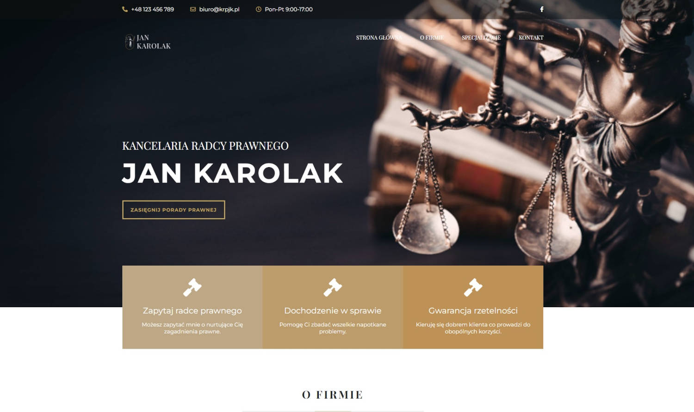

# lawyer-site

Website of Jan Karolak Law Firm of Attorney-at-Law. Project base on "Kinglaw - Attorney & Lawyer PSD Template". For styling I used preprocessor Sass and RWD technique with Desktop First approach. Also I used BEM metodology, JavaScript, AOS Css and EmailJS libraries.

## See it live

-   [GitHub Pages](https://mate966.github.io/lawyer-site/)
-   [Live Site](https://krpjk.pl)

## Built With

-   [Javascript](https://developer.mozilla.org/pl/docs/Web/JavaScript)
-   [SASS](https://sass-lang.com/)
-   [BEM](http://getbem.com/)
-   [EmailJS](https://www.emailjs.com/) - Email service
-   [AOS Css](https://michalsnik.github.io/aos/) - Animate on scroll library

## Author

-   **Mateusz Szweda** - [Mate](https://github.com/mate966)
-   **Kinglaw Template** - [Template](https://themeforest.net/item/kinglaw-attorney-lawyer-psd-template/21008102)
